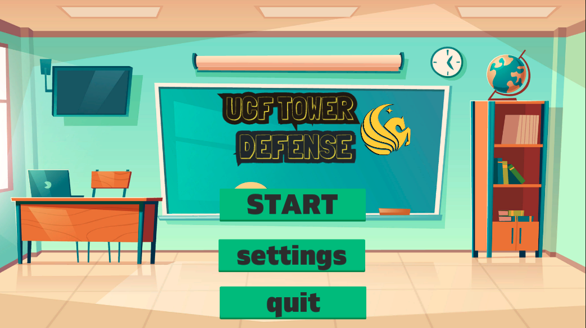

# UCF-Tower-Defense

# Vision Statement:

UCF Tower Defense is a game where UCF students battle to save their grades against professors of UCF. Unlike competitors like Bloons Tower Defense and Plants vs. Zombies, UCF Tower Defense provides an inclusive format that UCF students can relate to beyond a superficial level, such as levels that look like campus and enemies that look like professors. This will allow our Knights to feel at home even during the Zoom University era. Additionally, UCF Tower Defense offers easily understandable gameplay and a free-to-play environment. These features will present the player with a unique, entertaining experience that they could not find elsewhere. Go Knights, Charge On!!!

# Resources

[Trello Board (Backlogs and Requirements)](https://trello.com/b/epHd58wk/ucf-tower-defense)

[Burndown Chart](https://docs.google.com/spreadsheets/d/1fnH8CVBzcJMU6K55bMpOIfG0mbxfSTcWePDMlkh8kZU)

[Velocity Chart](https://docs.google.com/spreadsheets/d/1EDwsVtqA2Tud6Zaj3U7Hk-IkvPk0VgM0-r-bcr_cTxo)

[System Architecture](https://github.com/dabaquita/UCF-Tower-Defense/blob/main/architecture.md)

[Link to Source Code](https://github.com/dabaquita/UCF-Tower-Defense/tree/main/SampleProject/Assets/Scripts)

[Link to Test Code](https://github.com/dabaquita/UCF-Tower-Defense/tree/main/SampleProject/Assets/Tests/EditMode)

[Link to Manual Test(s)](https://github.com/dabaquita/UCF-Tower-Defense/blob/main/manual_testing.md)

[Product Demonstration for Sprint 2](https://drive.google.com/file/d/1k3H3xrmh-wEB5MJJSSlZbZ4AoLLnRNqX/view?usp=sharing)

[Product Demonstration for Sprint 3](https://drive.google.com/file/d/1cgwSWUqgP1UmW7IesoQGV5Kgx_plpGkD/view)

[Product Demonstration for Sprint 4](https://youtu.be/duCzEegWnQQ)

[Product Demonstration for Sprint 5](https://youtu.be/zzIR4FTOkSI)

[Product Demonstration for Sprint 6](https://youtu.be/wjL-dDijVn8)

[Product Demonstration for Sprint 7](https://www.youtube.com/watch?v=Fk5kM6GPYD4)

[Temporary Repository for Login Bug](https://github.com/ChrisForeman/UCF-TD-Login)

# Members
  Nicholas Nachowicz
  
  Denielle Abaquita

  Kirk Matthews (Matthews242)
  
  Christopher Foreman
  
  Recleph Mere

# Sprint 1 Task Allocation

Nicholas Nachowicz:
- Add minimum of 3 User Stories to the product backlog
- Install Unity and verify that it works on local environment
- Connect Unity to GitHub repository

Denielle Abaquita:
- Add minimum of 3 User Stories to the product backlog
- Create Trello Board, Google Docs, and Google Sheets for resources
- Install Unity and verify that it works on local environment
- Connect Unity to GitHub repository

Kirk Matthews (Matthews242):
- Add minimum of 3 User Stories to the product backlog
- Adjusted sprint and product backlogs to reflect what was worked on during the week
- Added requirements to the Trello Board
- Work on Velocity Chart and Burndown Chart with group
- Installed Unity and confirmed that project runs as expected on local environemnt

Christopher Foreman:
- Add minimum of 3 User Stories to the product backlog
- Install Unity and verify that it works on local environment

Recleph Mere:
- Add minimum of 3 User Stories to the product backlog
- Organize the product backlog and sprint backlog based on priority
- Add Requirements to Trello Board
- Work on Velocity Chart and Burndown Chart with group
- Install Unity & Connect Unity to github repository
- Ensure Unity development enviornment is in working state

# Sprint 2 Task Allocation

Nicholas Nachowicz:
- U021
- Enemy sprites
- System Architecture

Denielle Abaquita:
- Tower sprites
- Map graphics
- System Architecture

Kirk Matthews (Matthews242):
- System Architecture

Christopher Foreman:
- System Architecture

Recleph Mere:
- Fixed a UI Bug causing different aspect ratios to display incorrect button placement
- Added Background Music and SFX to Main Menu
- Added Settings Menu and audio configurations
- Added Keyboard & Joystick capability to the Main Menu

# Sprint 3 Task Allocation

Nicholas Nachowicz:
- U021, U023
- Enemy Sprites
- Tower Sprites
- Gridmap for tower placement
- Gridmap test
- Updated the UI diagram

Denielle Abaquita:
- U024, U021
- Build skeleton for level design and gameplay
- Map Graphics
- Tower Sprites
- Update the UML Diagrams

Kirk Matthews (Matthews242):
- U006, U024, U020

Christopher Foreman:
- Created Automated Tests for game classes

Recleph Mere:
- U020, U003
- Fix Audio and Animation bugs on menu and settings screen
- Refactor animation script

# Sprint 4 Task Allocation

Nicholas Nachowicz:
- U003, U005, U018, U021, U023
- Enemy Sprites
- Tower Buy menu
- Tower Placement Visuals

Denielle Abaquita:
- Tower Sprites
- Map graphics
- Enemy AI and health

Kirk Matthews (Matthews242):
- U018, U028
- Tower buy menu
- In-game UI shell
- Enemy handling

Christopher Foreman:
- Sprite path creation
- Enemy sprite path follower

Recleph Mere:
- Tower Placement Logic
- Game Audio Control

# Sprint 5 Task Allocation

Nicholas Nachowicz:
- U021, U022
- Map tilesets
- Tower selection menu and placement

Denielle Abaquita:
- U021, U029, U030
- Map tilesets
- Major Class Refactoring

Kirk Matthews (Matthews242):
- U001, U029, U030
- Audio Control
- Major Class Refactoring
- Health and Money UI

Christopher Foreman:
- U014, U015
- Firebase cloud function integration
- User account creation

Recleph Mere:
- U001, U022
- Enable All Towers to be Placed on Map
- Work on Making Towers Attack Enemy Sprites

# Sprint 6 Task Allocation

Nicholas Nachowicz:
- U021
- Design Pub Map/Scene

Denielle Abaquita:
- U007, U025
- Design GreekRow Map/Scene
- Implement Tower costs

Kirk Matthews (Matthews242):
- U007, U008
- Enemy spawning

Christopher Foreman:
- U014, U015
- Functionality for updating user xp and highscore
- Tests for user creation, user methods
- Database security logic

Recleph Mere (KilluaxGonx):
- U031, U032
- Projectile used for towers
- Tower Sprites Attack Enemey Sprites

# Sprint 7 Task Allocation

Nicholas Nachowicz:
- U021
- Tower Placement PUB map
- Tower Placement CB2 map
- Design PUB map

Denielle Abaquita:
- U021, U010, U020
- Tower unlocks based on level
- Student Union map and scene

Kirk Matthews (Matthews242):
- U010, U026
- Wave spawning bug fixes
- Tower unlocks based on level

Christopher Foreman:
- U014, U015
- Created Login UI 
- Created Signup UI 
- Finished user signup/login

Recleph Mere (KilluaxGonx):
- U031 
- Fixed Bug were Towers could be placed on Tower Selection Menu
- Fixed Bug were draggable sprite disappeared but user could still place Towers
- Added new function to cancel Tower placement using Esc key
- Added new function that disables Tower placement when selection menu is open
- Towers Sprites now fire projectiles at Enemy Sprites
- Tower Sprites now damage Enemy Sprites

# Sprint 8 Task Allocation

Nicholas Nachowicz:

Denielle Abaquita:
- Finalize all remaining map scenes
- Game balancing with points and damage
- Refactored Wave Spawning for both Adventure and Survival modes

Kirk Matthews (Matthews242):
- Tailored invidual waves for adventure mode
- Made survival mode throw random waves at you until your inevitable death

Christopher Foreman:

Recleph Mere (KilluaxGonx):
