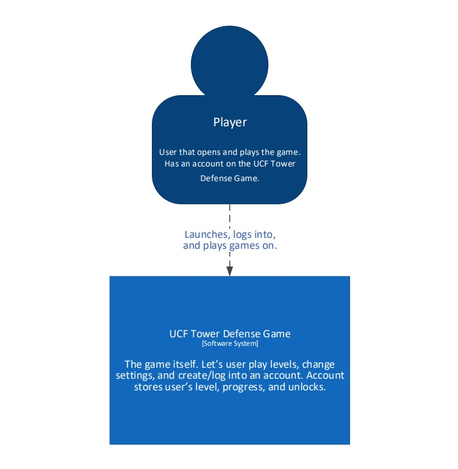

Populate each section with information as it applies to your project. If a section does not apply, explain why. Include diagrams (or links to diagrams) in each section, as appropriate.  For example, sketches of the user interfaces along with an explanation of how the interface components will work; ERD diagrams of the database; rough class diagrams; context diagrams showing the system boundary; etc. Do _not_ link to your diagrams, embed them directly in this document by uploading the images to your GitHub and linking to them. Do _not_ leave any section blank.

# Program Organization

You should have your context, container, and component (c4model.com) diagrams in this section, along with a description and explanation of each diagram and a table that relates each block to one or more user stories. 

See Code Complete, Chapter 3 and https://c4model.com/

System Context Diagram

The System Context Diagram shows the relationship of the overall system and the user(s) that will interact with it. In our case, the system consits of just a client and database, so there are no external systems shown. Additionally, only one type of user will interact with the system. This user is shown above.

Container Diagram

The Container Diagram shows the way the game client and database interact. As is shown, the user never directly interacts with the database; rather, the user interacts with the game client, which interfaces with the database.

Component Diagram

The Component Diagram breaks down the individual components of the overall system. The client opens up on a main menu screen, which has three options. The play option leads to two game modes - survival and adventure - which each lead into the gameplay component. That component controls the map, the enemy waves, and other features.

The settings option goes into a settings menu which allows you to control volume and difficulty.

The login/account option moves into a different component that interfaces with the database, loading the appropriate player information.

# Code Design

The UML Class Diagram breaks down the classes for the entirety of the game, especially gameplay. Development shall include the Player, Enemy, Tower, and Map classes to be available to use and modify.  

| Class | User Story ID  |
|---|---|
| Player | U028, U024, U003, U023, U018, U022, U004, U010, U012, U026  |
| Enemy  | U028, U024, U005, U007, U008  |
| Tower | U028, U003, U023, U018, U022, U009, U025  |
| Map | U006, U012  |

# Data Design

# Business Rules

You should list the assumptions, rules, and guidelines from external sources that are impacting your program design. 

See Code Complete, Chapter 3

# User Interface Design

You should have one or more user interface screens in this section. Each screen should be accompanied by an explaination of the screens purpose and how the user will interact with it. You should relate each screen to one another as the user transitions through the states of your application. You should also have a table that relates each window or component to the support using stories. 

See Code Complete, Chapter 3

# Resource Management

See Code Complete, Chapter 3

# Security

See Code Complete, Chapter 3

# Performance

See Code Complete, Chapter 3

# Scalability

See Code Complete, Chapter 3

# Interoperability

See Code Complete, Chapter 3

# Internationalization/Localization

See Code Complete, Chapter 3

# Input/Output

See Code Complete, Chapter 3

# Error Processing

See Code Complete, Chapter 3

# Fault Tolerance

See Code Complete, Chapter 3

# Architectural Feasibility

See Code Complete, Chapter 3

# Overengineering

See Code Complete, Chapter 3

# Build-vs-Buy Decisions

This section should list the third party libraries your system is using and describe what those libraries are being used for.

See Code Complete, Chapter 3

# Reuse

See Code Complete, Chapter 3

# Change Strategy

See Code Complete, Chapter 3
