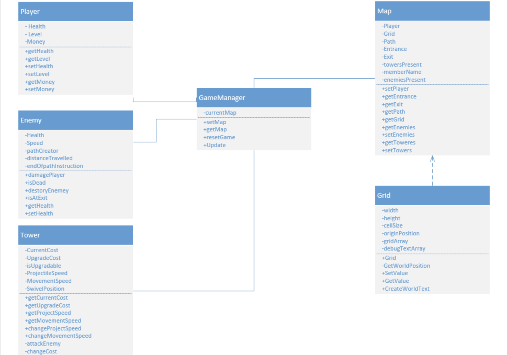

Populate each section with information as it applies to your project. If a section does not apply, explain why. Include diagrams (or links to diagrams) in each section, as appropriate.  For example, sketches of the user interfaces along with an explanation of how the interface components will work; ERD diagrams of the database; rough class diagrams; context diagrams showing the system boundary; etc. Do _not_ link to your diagrams, embed them directly in this document by uploading the images to your GitHub and linking to them. Do _not_ leave any section blank.

# Program Organization

System Context Diagram

The System Context Diagram shows the relationship of the overall system and the user(s) that will interact with it. In our case, the system consits of just a client and database, so there are no external systems shown. Additionally, only one type of user will interact with the system. This user is shown above.

Container Diagram

The Container Diagram shows the way the game client and database interact. As is shown, the user never directly interacts with the database; rather, the user interacts with the game client, which interfaces with the database.

Component Diagram

The Component Diagram breaks down the individual components of the overall system. The client opens up on a main menu screen, which has three options. The play option leads to two game modes - survival and adventure - which each lead into the gameplay component. That component controls the map, the enemy waves, and other features.

The settings option goes into a settings menu which allows you to control volume and difficulty.

The login/account option moves into a different component that interfaces with the database, loading the appropriate player information.

| Block | User Story ID  |
|---|---|
| UCF Tower Defense Game |  |
| Main Menu | U020 |
| Login Controller | U014, U010, U015 |
| Database | U004, U010, U017, U026 |
| Game Level Selection |  |
| Settings Menu | U002, U001, U011 |
| Adventure Mode | U004, U013 |
| Survival Mode | U004, U016 |
| Level Controller | U021, U028, U024, U003, U023, U018, U005, U007, U022, U006, U009, U008, U012, U025, U027 |

# Code Design

The UML Class Diagram breaks down the classes for the entirety of the game, especially gameplay. Development shall include the Player, Enemy, Tower, and Map classes to be available to use and modify.  

| Class | User Story ID  |
|---|---|
| Player | U028, U024, U003, U023, U018, U022, U004, U010, U012, U026  |
| Enemy  | U028, U024, U005, U007, U008  |
| Tower | U028, U003, U023, U018, U022, U009, U025  |
| Map | U006, U012  |

# Data Design

The user entity holds basic data for each user which shall only be viewable by the user who owns said data. The user map info holds user information about a given map, which was chosen for scalability as more maps are created. The map entity represents each playable map.
# Business Rules

This video game must uphold the rules and expectations of what is considered a tower defense video game. Tower defense is a strategy game whose goal is to defend the player's territory through placing defensive structures in order to stop enemies from reaching designated exits. This definition drives our video game design by requiring a top down map with entrances and exits for enemies as well as enabling the player to place towers on appropriate tiles on the map. 

Additionally, the product must be UCF themed, so the players will be expecting UCF graphics throughout the game - from the menu to the gameplay itself. Thus, this video game will have custom UCF assets designed by the creators implemented in the game. 

# User Interface Design

You should have one or more user interface screens in this section. Each screen should be accompanied by an explaination of the screens purpose and how the user will interact with it. You should relate each screen to one another as the user transitions through the states of your application. You should also have a table that relates each window or component to the support using stories. 

UCF Tower Defence UI Interface Diagram

Main Menu: This Screen will be the main hub and startup of our game. The user will have buttons to interact with on this menu. The buttons will lead to the settings, level select, and login menus. The buttons will read settings, start, and log in. There will be no other functions on this menu. It will basically be a title screen.

Settings: This menu will be the hub of changing simple options in the game. As of now the only basic settings to change are audio settings. The user will have sliders they can drag in order to change the volume of music, sound FX, and master volume. When the user is done they may exit using the main menu button.

Login: In this menu, the user will be able to enter their user information in order to save their data. If the user doesn’t have an account there will be a create an account button taking them to the account creation menu. After logging in or creating an account the user will be brought back to the main menu.
Account creation: In this menu, the user will be able to make a username and password in order to save their account information. The user will be brought back to the main menu.

Level select: In this menu, the user will be able to click on the level they wish to play however, levels with requirements (such as the previous level must be completed) may be locked. The user will also have the choice of difficulty with the options of easy, medium, and hard. When the user selects a level the game will start.

In-game menu: The in-game menu is where the user will see maps, towers, and enemies. The hud will display the user level, health, money, and game speed/pause. There will also be a tower select menu where a user can buy and upgrade towers as well as see descriptions and cost. This menu will be hidden until interacted with using a button that slides the menu onto the screen. The next three images will all pertain to the in-game menus.

# Resource Management

As far as resource management is concerned, we do not believe that there is a source of potential issues. The game does not use an excessive amount of memory and the intended deployment environment is not expected to be memory-constrained or outside of the intended scope. Furthermore, as far as scare resources are concerned, there should only ever be a single database connection open at once, as more are not needed.

# Security

For the purposes of this project, security is only a concern with the regards to the account login system. Accounts will authenticate with a password and username, and this information will be checked against what is stored in the database. No further security is of concern to this project since most other game functions do not need to be secured.

# Performance

Regarding performance, the main goal is consistency. The game should perform in a consistent fashion; that is to say, it should be repeatable in exactly the same way. Specific speed vs. memory vs. cost issues are not a concern given the sort of environment that we expect to release on.

# Scalability

Scalability is being built in be design. The levels themselves are modular, as is the tower creation process. Adding new levels or towers can be done simply in this way. The database is a small concern on this front, but it would take considerable development and play time for scaling to become a problem. Migrating to a larger database would not be difficult, but speed could become problematic in such a circumstance.

# Interoperability

The system is not expected to share data or resources with other software or hardware. The game consists of a client and a simple database; nothing else.

# Internationalization/Localization

The game’s menus, tutorial, and other items are going to be exclusively in English. Other locales are not supported by default and localization into other locales is not expected.

# Input/Output

For I/O, the system will use a look-ahead reading scheme for loading player data and storing it for use in the session. Changes will be stored to the database on a look-behind scheme to limit connections to the database. Errors would be detected at the stream level.

# Error Processing

Most error detecting will be detective rather than corrective. Players will be notified that an error has occurred, ideally with some information about why, and then it will quit in most cases. It will also be primarily active, checking actions as they occur for validity and then acting on them. Upon detecting an error, the system will enter an error-processing state to see if recovery is available. If it is, it will recover; else, it will fail, provide an error to the user, and exit.

Error messages will be displayed with a simple message stating that an error has occurred as well as some sort of readout or traceback that identifies where the error occurred.

Exceptions will be handled similarly to the error-checking state. They will not be logged or documented outside of in error readout. Errors or exceptions will be handled at the point of detection for speed and to prevent the creation of a catchall error-handling class. Each class will be responsible for handling its own errors.

While some of the environment’s built-in exception- and error-handling will be used where appropriate, we do not expect this to apply to all cases, so some cases will require us to create our own error-handling and integrate it.

# Fault Tolerance

There are very few faults expected in the system that would allow it to proceed unhindered. If a user gives a bad click or touch input, for example, it could reasonably be discarded and the user notified, but the program would continue to run. Similarly, if a link to the database cannot be established to load or store user information, the user could be notified, but choose to play anyways and not gain experience or other stored options.

For the majority of operations that cause a fault, though, the behavior would not be defined by the system and, not knowing how to handle it without breaking, the system would notify the user and exit.

# Architectural Feasibility

Systems similar to this one have been created before using the game engine and database options we’ve chosen. Furthermore, such systems exist with at a magnitude – or several magnitudes – above the scope of this system. As such, feasibility is not a concern.

# Overengineering

The system is minimally overengineered because the system accepts minimal user input. Outside of account creation wherein a user can only enter text – which is validated by the database connection – the user does not enter text at all. Their actions are based purely on clicking or on clicking and dragging. Placement of towers is only allowed in certain areas and trying to place them elsewhere will simply fail, but not affect the program in any way.

We do not anticipate a need to overengineer since there are so few breakable parts, and those that do exist are either minor enough to not cause a problem or so major that the system cannot recover.

# Build-vs-Buy Decisions

Unity: We are using Unity game engine as the foundation for building our game. We’re taking advantage of its out of the box graphics editor, and  multi-platform portability to build our game.

Firebase: We are using Google’s Firebase Firestore database solution to store our users’ data externally. Its out of the box Authentication, Security Rules, and Unity SDKs allow users to create an account to login and out of.

# Reuse

Although the game itself will not be using preexisting software or materials, the database security rules and cloud functions may need to be further defined for our user model use cases.

# Change Strategy

Since we are still learning the features and rules of Firebase and Unity, as we develop the system software so far, each step of the design has been balanced to be specific enough in order to fullfill the requirements, but general enough to allow changes in areas that may need to be determined in the future.
